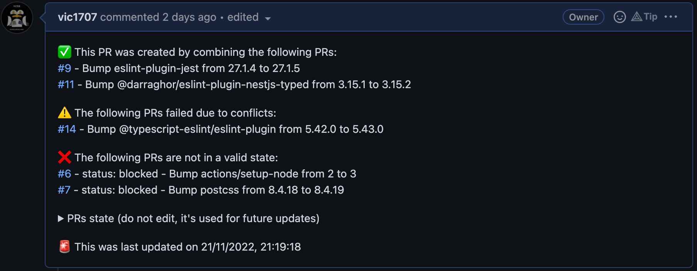

# GHA-combine-PRs

First I wan't to give credit to [hrvey's combine prs workflow](https://github.com/hrvey/combine-prs-workflow) who created the original workflow and most of the logic.

The base is identical, I just added typescript support, removed the graphql request (because it's not typesafe) and added a few more features such as incremental updates.

⚠️ Be aware: actions can't trigger other actions. So the Combine PR created by this action can't trigger your other workflows. Because of that, please don't forget to test everything yourself or trigger workflows manually! ⚠️

## Inputs

|         Name          | Description                                                                       |                          Default                           | Required |
| :-------------------: | --------------------------------------------------------------------------------- | :--------------------------------------------------------: | :------: |
|    `github-token`     | GitHub token                                                                      | is built-in, use `github-token: ${{secrets.GITHUB_TOKEN}}` |    ✅    |
|    `branch-prefix`    | Prefix of the branches to be combined                                             |                       `dependabot/`                        |    ❌    |
| `combine-branch-name` | Name of the branch to combine into                                                |                       `combine-PRs`                        |    ❌    |
|    `ignore-label`     | Label to ignore                                                                   |                        `nocombine`                         |    ❌    |
|    `must-be-green`    | The branches that would be combine must be green (CI is validated)                |                           `true`                           |    ❌    |
|   `always-recreate`   | Always recreate the combine branch (turns off the update feature)                 |                          `false`                           |    ❌    |
|   `survive-delete`    | The deletion of a ✅ PR will not trigger a rebuild from scratch of the combine PR |                          `false`                           |    ❌    |

## Basic usage

```yaml
name: 'Combine PRs'
on:
  schedule:
    - cron: '0 0 * * *'

jobs:
  combine:
    runs-on: ubuntu-latest
    steps:
      - name: GHA-combine-PRs
        uses: vic1707/GHA-combine-PRs@1.0.0
        with:
          github-token: ${{secrets.GITHUB_TOKEN}}
```

or

```yaml
name: 'Combine PRs'
on:
  schedule:
    - cron: '0 0 * * *'

jobs:
  combine:
    runs-on: ubuntu-latest
    steps:
      - name: GHA-combine-PRs
        uses: vic1707/GHA-combine-PRs@1.0.0
        with:
          github-token: ${{secrets.GITHUB_TOKEN}}
          branch-prefix: dependabot/
          combine-branch-name: combine-PRs
          ignore-label: nocombine
          must-be-green: true
          always-recreate: false
```

## What it does

This action will combine all the branches that match the `branch-prefix` into the `combine-branch` branch.

If the `combine-branch` branch does not exist, it will be created as well as the PR.
If the `combine-branch` branch exists, it will be updated and the PR will be updated with a new message except if the `always-recreate` is set to `true` in which case the branch will be deleted and recreated.

The checkout action (`actions/checkout@v2`) isn't required by this action because everything takes place via API calls.

### Updates cases (only applies if `always-recreate` is set to `false`)

After an update, the first PR message will always show the current state of the `combine-branch` branch.

If a previously `status: blocked` (from faild tests or no review) branch is now green, it will be combined and a new message will be added to the PR.

No matter what, a green branch that failed to combine will always be retried on the next attempt, if the new try succeeds a new message will be added to the PR, if not nothing will be done to the PR.

#### Update Cases

To describe the behavior of updates we will look at the PR message produced:

[](img/PR_Message.png)

We can see that PR's are regrouped by their status (3 possible statuses: ✅, ⚠️ or ❌).

When you re-run the action, if a PR "goes up 1-2 statuses" in the status list, a new message will be added to the PR with the actualized status.
For example, if a PR was ❌ and succeds the combine, it will be moved with the other successful combines and a new message will be added to the PR.

If a PR goes from ⚠️ to ❌, a new message will be added to the PR with the actualized status.

If a ✅ PR gets updated and is still green it will trigger a normal update.

#### ⚠️⚠️⚠️ Scenarios that restarts the action from scratch (brand new branch and PR) ⚠️⚠️⚠️

- Changes of any kind to a ✅ PR (PR closed, review dissmissed, branch deleted, etc...).
- Fail to parse the previous state on the first PR message.

`survive-delete` is a boolean input that will prevent the action from restarting from scratch if a ✅ PR is deleted.

No matter what, the first message of the PR always represents the current state of the `combine-branch` branch.

## Improvements

- [ ] Add inputs for `reviewers` and `team-reviewers` (the question is more about the format of the input, ex: comma/space separated, multiline, etc.).
- [ ] Add unit tests by mocking Github API responses.
- [ ] Combine PR is opened with a `draft` status, if someone needs it I will add an input for it.

## Notes

- Combined branches aren't deleted on combine to avoid loosing data if the combine branch is deleted (ex. `always-recreate` is set to `true`).
- The update message cannot be posted before the commits it refers to are pushed.
- Squash is not supported (by Github API).

## Contributing

Contributions are welcome! Please open an issue or a PR.
Every feature or idea is welcome.
My only requests are

- keep the code as readable as possible (add comments when needed)
- respect `eslint` and `prettier` rule (don't disable them)
- never use the `any` type, this action is focused on typescript's type safety and auto-completion
- because of type safety only use the REST API (no GraphQL because it's not typed)
- if you add an input don't forget to add it in the `global.d.ts`, `README.md` and `.env.example` files
